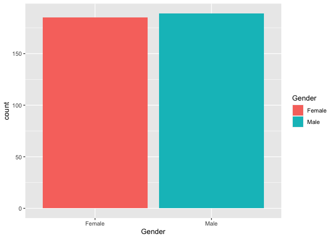
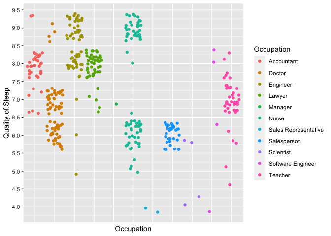

DS 202 Final Project
================

<!-- README.md is generated from README.Rmd. Please edit the README.Rmd file -->
<!--
This repository serves as a starter repo for your final project, and this Rmd is supposed to serve as a starter file for your project report.
&#10;## Part I: Repo Structure {.unnumbered}
&#10;The structure sketched out below is an idea of what your repository might look like. You can use it as a starting base and change according to your needs. But think about the changes that you make!
&#10;    -- code
    |   |   -- any R scripts you need but don't want to include directly in the write-up
    -- data
    |   |   -- csv files (cleaned data)
    -- data-raw
    |   |   -- raw data files 
    |   |   -- data description files, origin
    |   |   -- Codebook
    -- final-project.Rmd
    -- images  # only images that are not created by the Rmd
    -- LICENSE
    -- README.md
    -- README.Rmd
    -- README_files # folder with files created during the knitting process
&#10;## Part II: Project report {.unnumbered}
&#10;
-->

# Sleep Health and Lifestyle

Authors: Gabriel Getzinger, Michael Friedman

## Abstract (TL;DR)

In this project we will perform exploratory data analysis on a Kaggle
sourced
[dataset](https://www.kaggle.com/datasets/uom190346a/sleep-health-and-lifestyle-dataset/data?select=Sleep_health_and_lifestyle_dataset.csv)
with information regarding sleep quality along with various other
biometric factors. We will attempt to uncover any underlying patterns in
the data that may be helpful to know if one unfortunately suffers from a
sleep disorder. As the project progresses, new datasets may be
introduced as more questions arise.

<!--
&#10;-   what is the project about?
-   what is the motivation for doing it?
-   what data is your work based on? and where does it come from? = what are your main findings? (one sentence each)
&#10;-->

# Intro/Background/Motivation

According to the [Mayo
Clinic](https://www.mayoclinic.org/diseases-conditions/sleep-disorders/symptoms-causes/syc-20354018):

*“A sleep disorder can affect your overall health, safety and quality of
life. Sleep deprivation can affect your ability to drive safely and
increase your risk of other health problems.”*

<!--
&#10;At the end of the Intro, write a sentence describing what each of the (result) sections is about, e.g. in section [Results 1] we show the relationship between XXX and YYY,  section [Results 2] also considers the effect of variable ZZZ. ...
Finally we conclude with a quick summary of our findings and potential follow-up work in section [Conclusions].
&#10;Somewhere at the beginning of your project, include a code chunk that includes all of the R packages you are using throughout. In this document, the setup code chunk is called `setup` (see line 8) Also make sure to set defaults for the code chunks - like should they be visible? (probably not: echo=FALSE). Do you want to automatically include warnings? (probably yes, for creating the Rmd, to make sure that all warnings are accounted for)
&#10;-->

# Quick Data Summary

    ## function (x, df1, df2, ncp, log = FALSE)

| Person.ID | Gender | Age | Occupation           | Sleep.Duration | Quality.of.Sleep | Physical.Activity.Level | Stress.Level | BMI.Category | Blood.Pressure | Heart.Rate | Daily.Steps | Sleep.Disorder |
|----------:|:-------|----:|:---------------------|---------------:|-----------------:|------------------------:|-------------:|:-------------|:---------------|-----------:|------------:|:---------------|
|         1 | Male   |  27 | Software Engineer    |            6.1 |                6 |                      42 |            6 | Overweight   | 126/83         |         77 |        4200 | None           |
|         2 | Male   |  28 | Doctor               |            6.2 |                6 |                      60 |            8 | Normal       | 125/80         |         75 |       10000 | None           |
|         3 | Male   |  28 | Doctor               |            6.2 |                6 |                      60 |            8 | Normal       | 125/80         |         75 |       10000 | None           |
|         4 | Male   |  28 | Sales Representative |            5.9 |                4 |                      30 |            8 | Obese        | 140/90         |         85 |        3000 | Sleep Apnea    |
|         5 | Male   |  28 | Sales Representative |            5.9 |                4 |                      30 |            8 | Obese        | 140/90         |         85 |        3000 | Sleep Apnea    |

Upon our initial first glance at the dataset, we found one item we could
clean right away. The redundant category shown can be grouped together
with the other one with the similar name:

``` r
df[["BMI.Category"]] %>% unique()
```

    ## [1] "Overweight"    "Normal"        "Obese"         "Normal Weight"

``` r
df$BMI.Category[df$BMI.Category == "Normal Weight"] <- "Normal"
df[["BMI.Category"]] %>% unique()
```

    ## [1] "Overweight" "Normal"     "Obese"

An initial view of all subjects by…  

Weight category:  
<!-- -->  
Gender:  
<!-- -->  

Self-reported sleep quality grouped by occupation:  
<!-- -->  
Note that the nurses responses are bifurcated, likely due to a 12-hour
shift schedule.  

<!--
&#10;What are the variables that you will be using in the main part of the report? What are their ranges? You could include a table with variable names, a short explanation, and (very broad) summary statistics.
&#10;-->

# Results

What occupation has the worst sleep quality? Highest incidence of
disorder?

Sleep disorder by occupation probability table.

    ##                       
    ##                          Insomnia       None Sleep Apnea
    ##   Accountant           0.18918919 0.81081081  0.00000000
    ##   Doctor               0.04225352 0.90140845  0.05633803
    ##   Engineer             0.07936508 0.90476190  0.01587302
    ##   Lawyer               0.04255319 0.89361702  0.06382979
    ##   Manager              0.00000000 1.00000000  0.00000000
    ##   Nurse                0.04109589 0.12328767  0.83561644
    ##   Sales Representative 0.00000000 0.00000000  1.00000000
    ##   Salesperson          0.90625000 0.06250000  0.03125000
    ##   Scientist            0.00000000 0.50000000  0.50000000
    ##   Software Engineer    0.25000000 0.75000000  0.00000000
    ##   Teacher              0.67500000 0.22500000  0.10000000

There are a few oddly high proportions in the table. This is due to a
small number of observations for certain occupations. The table below
examines the row count of each observation.

    ## 
    ##           Accountant               Doctor             Engineer 
    ##                   37                   71                   63 
    ##               Lawyer              Manager                Nurse 
    ##                   47                    1                   73 
    ## Sales Representative          Salesperson            Scientist 
    ##                    2                   32                    4 
    ##    Software Engineer              Teacher 
    ##                    4                   40

Manager (1), Sales Rep (2), Scientist (4) and Software Engineers (4) all
contain substantially lower row counts than the remaining occupations.

Sleep disorder by occupation probability table w/o aforementioned
occupations.

    ##              
    ##                 Insomnia       None Sleep Apnea
    ##   Accountant  0.18918919 0.81081081  0.00000000
    ##   Doctor      0.04225352 0.90140845  0.05633803
    ##   Engineer    0.07936508 0.90476190  0.01587302
    ##   Lawyer      0.04255319 0.89361702  0.06382979
    ##   Nurse       0.04109589 0.12328767  0.83561644
    ##   Salesperson 0.90625000 0.06250000  0.03125000
    ##   Teacher     0.67500000 0.22500000  0.10000000

Salespeople (0.06) had the lowest proportion of neither disorders,
followed by nurses (0.12) and teachers (0.23). The other four
occupations all had relatively high proportions of neither disorders.

Average sleep quality by occupation.

    ##    Occupation Quality.of.Sleep
    ## 1  Accountant         7.891892
    ## 2      Doctor         6.647887
    ## 3    Engineer         8.412698
    ## 4      Lawyer         7.893617
    ## 5       Nurse         7.369863
    ## 6 Salesperson         6.000000
    ## 7     Teacher         6.975000

Salespeople (6.0) reported the lowest sleep quality, followed by doctors
(6.65) and teachers (6.98).

Which disorder is most prevalent among highest stressed?

Sleep disorder by stress level probability table.

    ##    
    ##       Insomnia       None Sleep Apnea
    ##   7 0.82000000 0.06000000  0.12000000
    ##   8 0.04285714 0.47142857  0.48571429

Correlations

Convert character variables to numeric variables.

Correlations between disorder and: stress level, gender, occupation.

    ## [1] -0.0360578

    ## [1] -0.2534153

    ## [1] -0.1698002

None of the correlations suggest a relationship.

Correlations between sleep quality and: heart rate, occupation.

    ## [1] -0.6598647

    ## [1] -0.2780711

None of the correlations suggest a relationship.

<!--
&#10;Each line of exploration is supposed to be featured in one of the Results sections. Make sure to change to more interesting section headers!
&#10;Figure 1: BMI
Bar chart of BMI in the population split into three categories: 'Normal', 'Obese' and 'Overweight'. 'Normal' is most frequent followed by 'Overweight' and then 'Obese'.
&#10;Figure 2: Gender
Bar chart of gender in the population. As expected, the gender distribution is nearly split 50/50.
&#10;Figure 3: Sleep Quality by Occupation
Scatterplot of sleep quality by occupation.
&#10;...
&#10;# Conclusions
&#10;unfortunately, the data wasn't super telling. We didn't walk away with any strong trends or patterns.
&#10;## Data source {.unnumbered}
&#10;Where does the data come from, who owns the data? Where are all the scripts that you need to clean the data?
&#10;The data is from Kaggle. The Kaggle author is Laksika Tharmalingam
&#10;-->

## References

[Link to Kaggle
dataset](https://www.kaggle.com/datasets/uom190346a/sleep-health-and-lifestyle-dataset/data?select=Sleep_health_and_lifestyle_dataset.csv)
